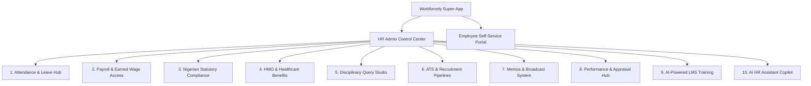

# 🚀 Workforcely - Executive Platform Overview & Architecture

> **The All-in-One AI-Powered HR, Payroll, Compliance & Employee Experience Platform**
> *Designed for modern African & global enterprises.*

---

## 📌 Executive Summary

**Workforcely** is a next-generation Cloud HR Super-App designed to eliminate HR operational bottlenecks, streamline payroll & statutory compliance, boost employee retention, and provide a seamless self-service portal for staff.

Unlike traditional, fragmented HR systems that only record attendance or generate basic payslips, Workforcely integrates **12 core HR verticals** into a single, unified interface—powered by **AI automation**, **Earned Wage Access (EWA)**, **Nigerian Statutory Compliance Hubs**, and **Paperless HMO Benefit Portals**.

---

## 🏗️ Core Technology Stack

* **Frontend Framework**: Next.js 14 (App Router), React 18, TypeScript.
* **Styling & Design System**: Vanilla CSS (`globals.css`) with CSS custom properties (tokens), responsive glassmorphism cards, dynamic dark/light themes, and HSL tailored color palettes.
* **Icons & Visual Assets**: Lucide React.
* **Database & Data Engine**: High-performance JSON Database Layer (`src/lib/db.ts`) with multi-tenant relational data models, cached getters, and real-time state triggers.
* **AI Engine**: Integrated AI Copilot (`/api/ai`) for natural language HR policy queries and course generation.

---

## 🧩 Comprehensive Module Breakdown



---

### 1. 🏢 HR Admin Control Center vs. Employee Self-Service
* **Role-Based Access Control (RBAC)**: Real-time role switching between **HR Admin** and **Employee**.
* **HR Admin Dashboard**: High-level executive metrics (Total Headcount, Active Leave Requests, Monthly Payroll Spend, Open Queries, Course Completion Rates).
* **Employee Portal**: Personalized home view with active attendance status, quick leave requests, payslip downloads, active HMO coverage details, and assigned training courses.

---

### 2. ⏱️ Attendance & Leave Management
* **Geofenced Check-In / Check-Out**: Real-time IP & GPS check-in status with clock-in/out timestamps and automatic status tagging (*Present*, *Late*, *On Leave*, *Absent*).
* **Leave Requests & Approval Workflows**: Employees apply for Annual, Sick, Maternity, or Casual leave with date pickers. HR Admins review and click **Approve** or **Reject** with automated leave balance deduction.

---

### 3. 💳 Payroll & Earned Wage Access (EWA)
* **Automated Payroll Processing**: Calculates Gross Salary, PAYE Tax, Pension contributions, NHF, ITF, net pay, and generates downloadable digital payslips.
* **Earned Wage Access (EWA) Simulator**: Staff can view accrued wages earned so far in the month and request an instant withdrawal of up to **50% of earned pay** before payday.

---

### 4. 🇳🇬 Nigerian Statutory & Tax Compliance Hub
* **Automated Deduction Calculators**:
  * **PAYE Tax**: Calculated in alignment with state tax laws (e.g. LIRS).
  * **Pension (PenCom)**: 10% Employer + 8% Employee statutory split.
  * **National Housing Fund (NHF)**: 2.5% of basic salary.
  * **Industrial Training Fund (ITF)**: 1% annual payroll contribution.
* **One-Click CSV Schedule Exporters**: Download pre-formatted schedules for direct submission to tax authorities and Pension Fund Administrators (PFAs).

---

### 5. 🏥 HMO & Healthcare Benefits Portal
* **Paperless HMO Enrolment**: Staff choose their HMO tier (*Reliance, Hygeia, AXA Mansard, Leadway*) and register family dependants (**Spouse & Children**).
* **Emergency Out-of-Pocket Refund Claims**: Staff file claims for out-of-network emergency medical expenses; HR reviews and approves refunds directly into payroll.
* **Provider Remittance Exporter**: Export consolidated enrolment schedules for insurance providers.
* **Strict Data Privacy**: Employees only see their own health plan and family dependants; HR Admins manage the company-wide enrollee directory.

---

### 6. 📜 Disciplinary Query Studio & Sanctions
* **Official Query Authoring**: HR authors queries with violation tags (*Insubordination, Lateness, Misconduct*).
* **48-Hour Deadline Countdown**: Visual countdown timer enforcing prompt responses.
* **Employee Defense Submission**: Employees submit formal written defenses directly within their portal.
* **Sanction Ledger**: Audit trail tracking official warnings, suspensions, or cases cleared.

---

### 7. 🎯 Recruitment & Applicant Tracking System (ATS)
* **Kanban Hiring Board**: Drag-and-drop / click-to-move applicant pipelines across stages: *Applied ➔ Screening ➔ Interview ➔ Offered ➔ Hired*.
* **Public Job Board**: Public candidate portal (`/recruitment/[jobId]`) where candidates view job descriptions and apply online.

---

### 8. 📢 Company Memos & Broadcast System
* **Broadcast Announcements**: HR publishes company-wide policy updates, holiday notices, and executive memos with priority tags (*Urgent*, *Standard*, *Policy Update*).

---

### 9. 📈 Performance & Goal Appraisals
* **KPI & Goal Tracking**: Set quarterly targets, track progress bars, and conduct performance reviews.

---

### 10. 🎓 AI-Powered Learning Management System (LMS)
* **AI Course Generator**: HR generates complete courses with structured modules and quizzes in seconds via AI prompts.
* **Interactive Course Player**: Sequential lesson reader with progress tracking.
* **Evaluation Quizzes & Retake Feature**: Automated grading with quiz attempt tracking and course retake capabilities.
* **Workforcely Certificate of Completion**: Instant generation and HTML/PDF download of official completion certificates.

---

### 11. 🤖 AI Copilot & Assistant
* **Natural Language HR Assistant**: Conversational AI chatbot for policy lookups, employee queries, and administrative support.

---

## 🌟 Strategic Market Differentiators (Why Workforcely Wins)

| Feature | Standard HR Software | Workforcely |
| :--- | :---: | :---: |
| **Earned Wage Access (EWA)** | ❌ No | ✅ Integrated On-Demand Pay |
| **Statutory Tax Exporters** | ⚠️ Generic CSV | ✅ Nigerian LIRS, PenCom, NHF & ITF Schedules |
| **Out-of-Pocket HMO Claims** | ❌ No | ✅ Emergency Refund Queue & Approval |
| **Disciplinary Query Studio** | ❌ Basic Text | ✅ 48h Countdown Timers & Formal Defenses |
| **AI Course Generator** | ❌ Manual Upload | ✅ Automated Course & Quiz Builder |
| **Verified Certificates** | ❌ Extra Cost | ✅ Automated Certificate Engine |

---

## 🚀 Getting Started & Local Development

### 1. Installation
```bash
git clone https://github.com/Rokan0-0/workforcely.git
cd Workforcely
npm install
```

### 2. Running the Development Server
```bash
npm run dev
```
Open [http://localhost:3000](http://localhost:3000) in your browser.

### 3. Production Build & Verification
```bash
npm run build
```

---

*© 2026 Workforcely Inc. All rights reserved.*
